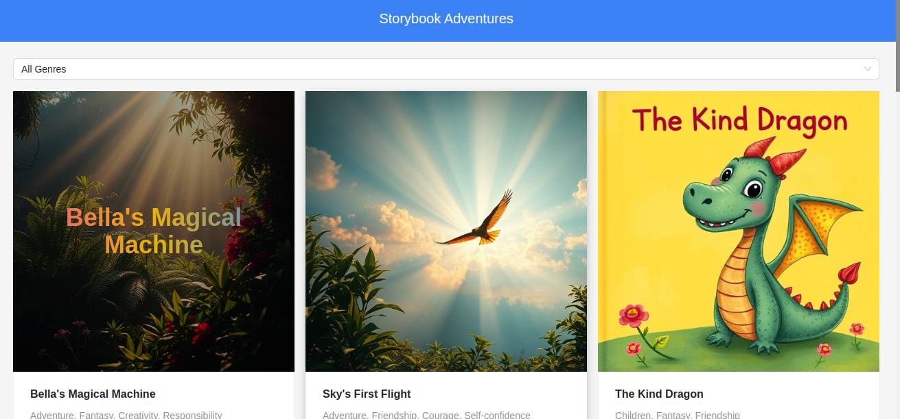
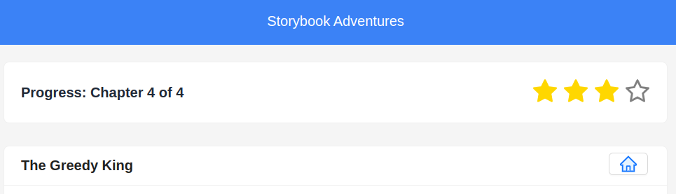
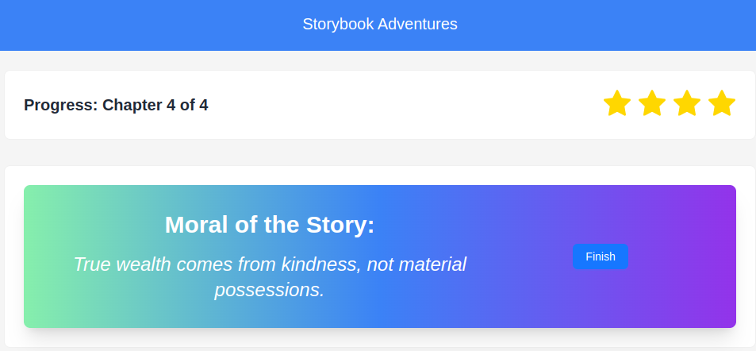
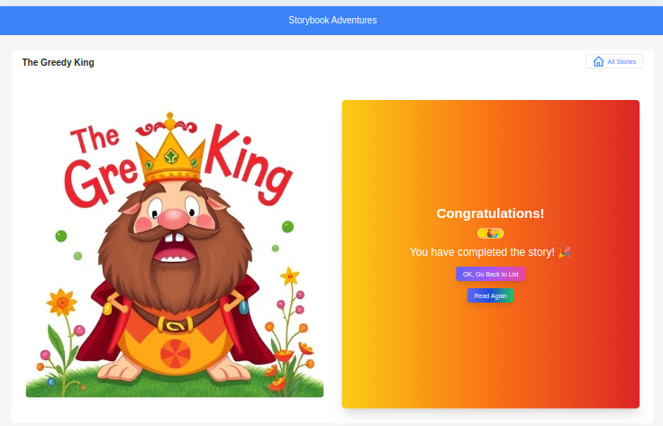
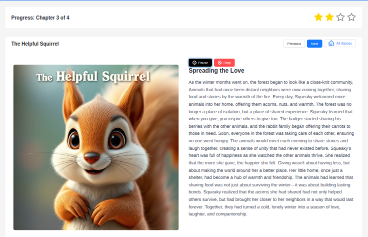

# Welcome to Storybook Adventures! 📖✨

Hey there, young adventurer! Welcome to **Storybook Adventures** — a fun and magical world of stories where you can read exciting tales, explore new chapters, and discover awesome morals at the end. Let's dive into the fun!

---

## What's This App About?

**Storybook Adventures** lets you:

- **Read Awesome Stories**: Explore cool chapters and find out what happens next!
- **Track Your Progress**: See how far you’ve come by looking at the stars ⭐. Each star means a chapter you've completed.
- **Find the Moral**: At the end of the story, discover a fun lesson that helps you in life!
- **Get a Congratulations Badge**: After finishing the story, you’ll get a special “congratulations” message with a golden badge 🎉.
- **Navigate Easily**: Move between chapters with "Next" and "Previous" buttons to go wherever you like!
- **Fixed Header**: Our header stays at the top while you read, so you can always go back to the story list if you need to!
- **Text-to-Speech Feature**: You can now listen to the story being read aloud! Play, pause, and stop the speech at any time, with voice selection based on your preferences.

---

## Features You’ll Love

- **Interactive Story Reading**: You can read each chapter, and when you’re done, mark it as finished with a star! ⭐
- **Progress Tracker**: Get stars for every chapter you finish. The more stars, the closer you are to finishing the story!
- **Moral of the Story**: Every story teaches you something valuable, and you’ll see it at the end of the last chapter.
- **Text-to-Speech**: Listen to the story as it’s read aloud with full play, pause, resume, and stop controls.
- **Voice Selection**: Choose between available voices for the speech, including an English voice.
- **Responsive Design**: The app works on both your computer and phone, so you can read anytime, anywhere!

---

## How to Play

### Reading a Story

1. **Start the Story**: When you click on a story, you’ll start reading Chapter 1!
2. **Next Chapter**: After finishing a chapter, click the **Next Chapter** button to read the next part of the story.
3. **Previous Chapter**: If you want to go back, click the **Previous Chapter** button to read what happened earlier!
4. **Stars for Progress**: Each time you finish a chapter, you’ll see a **star** next to it. You’ll get more stars as you go along!
5. **Find the Moral**: When you finish the last chapter, the story will show you a **moral** — a valuable lesson you can use in your life.

### After Finishing the Story

When you finish a story:

- You’ll see a **Congratulations** message and a shiny badge 🎉 to celebrate your adventure!
- There will be a button that says **OK, Go Back to List**. Click it to go back to the list of all stories and choose another one!

### Using the Text-to-Speech Feature

1. **Play the Story**: Click the "Play" button to have the story read aloud to you.
2. **Pause/Resume**: If you need a break, click the "Pause" button to stop the speech. You can resume it by clicking "Resume."
3. **Stop**: You can stop the speech completely by clicking the "Stop" button.
4. **Voice Selection**: The story will use a voice based on your language preferences (e.g., English).

---

## Demo

🎉 **Try Storybook Adventures live!** 🎉

Want to see how **Storybook Adventures** works without setting it up yourself? Check out the live demo link below:

[**https://sadaigm.github.io/storybook-adventures/**](https://sadaigm.github.io/storybook-adventures/)

Feel free to explore, read the stories, and even try the new text-to-speech feature! 📖✨

---

## Technologies We Used (For Curious Minds 😃)

- **React**: This is the tool we used to make the app interactive and fun.
- **Ant Design**: We used this to make the buttons and cards look nice and shiny.
- **Tailwind CSS**: This is a magical tool that helps make everything look pretty and stylish.
- **TypeScript**: It helps make sure everything works smoothly and correctly.
- **React Router**: This helps you navigate from one story to another easily.
- **SpeechSynthesis API**: This API allows us to read stories aloud using text-to-speech functionality.
- **Ant Design Icons**: For sleek, interactive icons for play, pause, and stop functionality.
- **Vite**: A fast and modern build tool that helps us develop and bundle the app quickly.

---

## How to Start Playing (For Big Kids 👩‍💻👨‍💻)

To get started with this app on your own computer, follow these steps:

1. **Clone the project** (don’t worry, it’s like copying it to your computer):

   ```bash
   git clone https://github.com/sadaigm/storybook-adventures.git
   cd storybook-adventures
   ```

2. **Install all the needed tools** (just like setting up your toys before playing):

   ```bash
   npm install
   ```

3. **Start the app** (run the app and get started!):

   ```bash
   npm run dev
   ```

4. **Enjoy**! Head over to [http://localhost:5173](http://localhost:5173) and start reading your stories!

---

## What’s Inside the Project? (For Curious Minds 🧐)

Here’s what’s inside the `src` directory:

```
/storybook-adventures/src/
  ├── const.ts                  # Contains constants used across the app
  ├── index.css                 # Global styles for the app
  ├── main.tsx                  # Main entry point of the app
  ├── stories                   # Folder containing all story-related components
  │   ├── components            # Story components
  │   │   ├── CustomImage.tsx   # A special image component for showing pictures
  │   │   ├── NewSpeechPlayer.tsx  # New speech player component for text-to-speech functionality
  │   │   └── SpeechPlayer.tsx  # Older speech player component
  │   ├── data.ts               # Contains data for stories
  │   ├── StoryDetails.tsx      # The page where you read each story
  │   ├── StoryHome.tsx         # The home page showing available stories
  │   ├── StoryList.tsx         # List of available stories
  │   └── types.ts              # Types for the app, like story data types
  ├── tree.txt                  # Directory structure of the project (can be generated with the tree command)
  └── vite-env.d.ts             # Vite-specific environment declaration file
```

---

## Contribute (For Superheroes 🦸‍♀️🦸‍♂️)

Want to help make the app even better? Here’s how you can contribute:

1. **Fork** the repository (like making your own copy).
2. **Create a new branch** for your changes.
3. **Make your changes** and save them!
4. **Push your changes** to your own copy of the repo.
5. **Create a pull request** to add your changes to the main app.

---

## License (For the Legal Eagles 🦅)

This app is licensed under the MIT License, which means you can use it, change it, and have fun with it! Check the [LICENSE](LICENSE) file for more details.

---

## Screenshots (For Your Imagination 👀)

Here are some cool images from the app:

### Stories List


### Reading a Story


### Progress with Stars



### Congratulations!


### Play the Story


---

## Have Fun and Keep Reading! 📚🎉

Now go ahead, open up a story, and enjoy your reading adventure in **Storybook Adventures**!

---

### Key Changes for Vite:

- Replaced `npm start` with `npm run dev` since Vite uses `dev` for local development.
- Used `vite` for fast and efficient bundling.
- Modified the install process to reflect the setup with `npm` or `yarn` (depending on your preference).

---